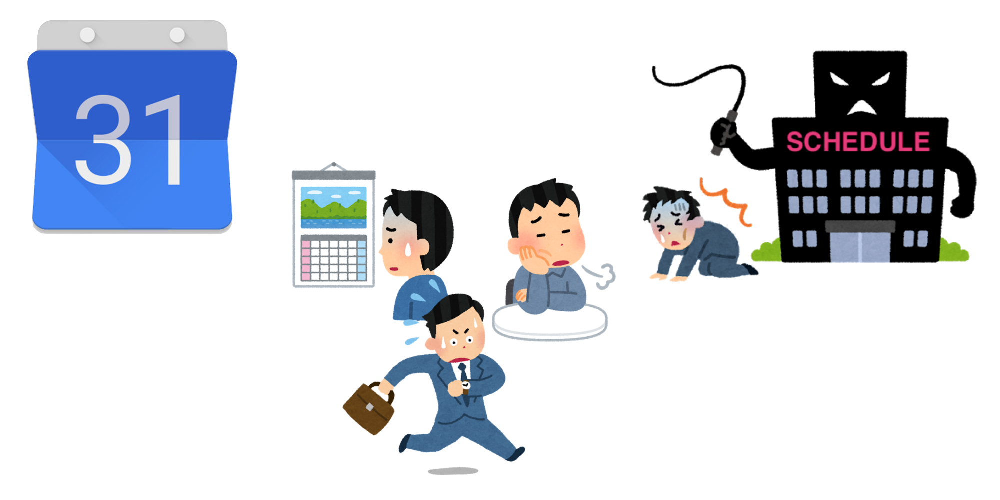
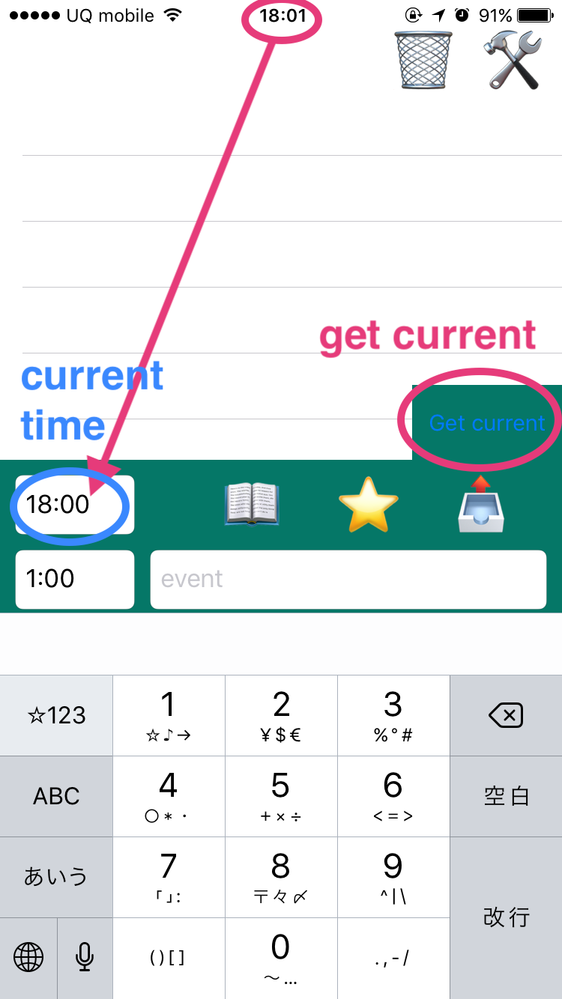
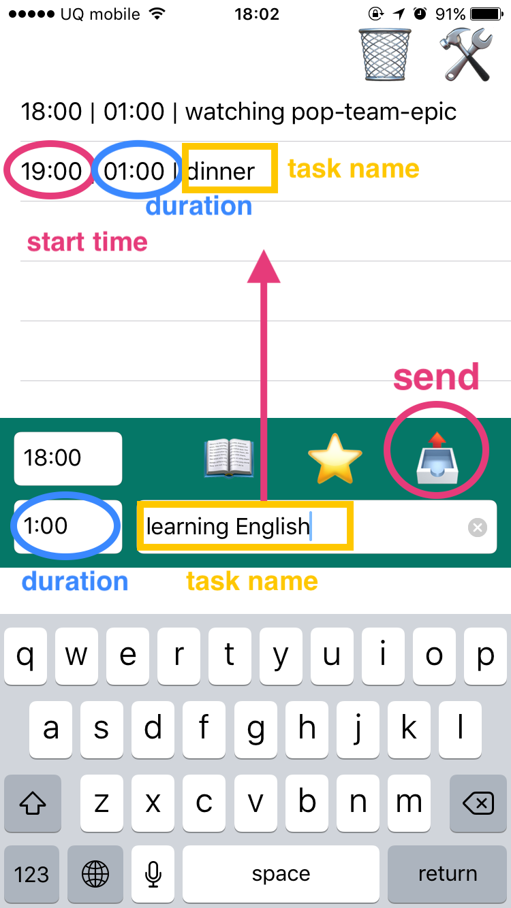
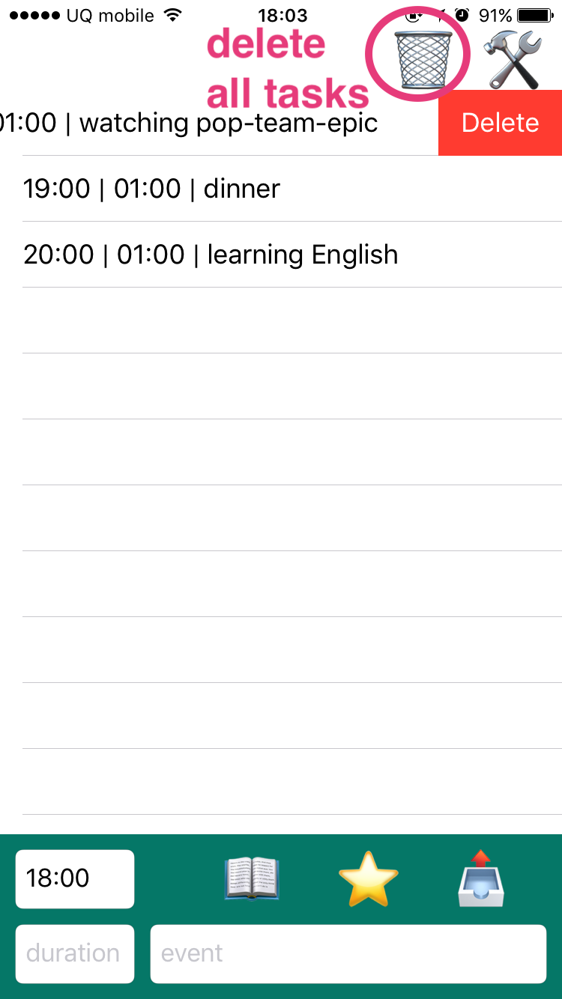
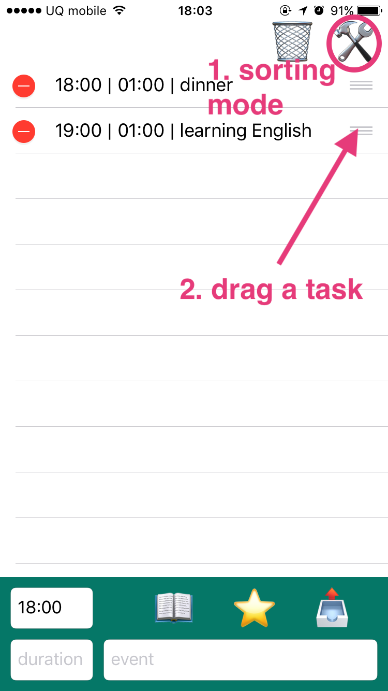

# Take it Easy

This is an iOS application to *"flexibly"* manage your time.

This app runs on *[Pythonista](http://omz-software.com/pythonista/)*.

# Why is this *"flexible"* ?

While **calendar app** can manage your time by minute, it is **not flexible** to reschedule. 
There are so many times to reshedule because of your bad planning, your coworker's delay and the lack of motivation etc.

Meanwhile with **ToDo list app**, you can quickly reschedule, sorting your tasks.
But, these tasks in the list have **no start/end time**.
Your work might not be on time.

**Take it Easy** cherrypick the both app's benefits.
It can manage your time **by minute**
and can also **quickly reschedule**.

# Usage

- Set the current time
- Add your tasks to a list
- Delete a task when it's done
- Sort the tasks when rescheduling

## Set the current time

Input the current time (e.g. 6:30) in the text field.

This is needed to **calculate the start time** of each task.

If you tap **get current** button, 
it automatically fills the text field with the actual current time.
(NOTE: **get current** button get the current time by 30 minutes,
e.g. 6:30, 7:00, 7:30, ...)

## Add your tasks to a list

Input your task's **name** and **duration** on text fields.

**duration** is the time which the task takes.

Send the task to the list using **send** button.

You should just do the task from the top of the list afterwards.

- First column: the **start time** of the task
- Second column: the **duration** the task takes

I recommend setting durations **by 30 minutes**.
(e.g. 0:30, 1:00, 1:30, ...)
This method is compatible with [Pomodoro Technique](https://en.wikipedia.org/wiki/Pomodoro_Technique).

## Delete a task when it's done

When you finish a task, swipe the task left.

If you want to delete all tasks, just tap the **garbage** botton.

## Sort the tasks when rescheduling

If you want to reschedule, tap the **sorting** botton and sort the tasks.
This app automatically re-calculate each task's start time.

You **don't need to change the start/end time of all tasks**
unlike the conventional by-minute time management apps such as calendar apps.

# Installation

1. install *[Pythonista](http://omz-software.com/pythonista/)* on your iOS.
2. install *[DropboxSync](https://github.com/Pythonista-Tools/Pythonista-Tools/blob/master/Utilities.md)* on your Pythonista.
3. clone this repository on your *DropboxSync* directory on your Pythonista
4. run *DropboxSyncv2.py* script on your iOS to share this repository. (your_PC/this_repo -> your_iOS/Pythonista/DropboxSync/this_repo)
5. run *take_it_easy/main.py*
